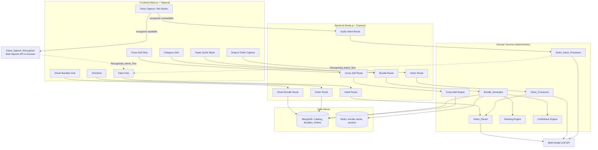

# Design Document

## Overview

Amazon Instant Engine is a mobile-first responsive web application that flips the shopping model from "search-first" to "intent-first." A user expresses an outcome ("Make paneer bhurji", "Office emergency kit") through free text, spoken voice, an uploaded image, or a one-tap Smart Bundle, and the system returns a complete, purchasable shopping bundle within seconds.

The four input modalities — typed text, voice, image, and Smart Bundle — all converge on the same `StructuredIntent` contract. Voice and image are pre-processing front-ends that produce text (`Recognized_Intent_Text` for voice, a vision-derived text intent for image); that text flows into the **same** typed `Intent_Parser` path, so downstream bundle generation, ranking, and checkout are identical regardless of how the intent was expressed.

This design covers the 48-hour hackathon MVP while keeping the architecture extensible toward a production product. It addresses the five core features (Intent Hub, Snap & Order, Goal-Oriented Category Grid, Super Quick Mode 3-Tier Basket, Contextual Cross-Sell) and the cross-cutting concerns (intent understanding, bundle generation and ranking, performance, trust and explainability, error/unavailable-item handling, and checkout).

### Technology Stack

The stack follows the requirements and supporting product docs:

| Layer | Technology | Rationale |
| --- | --- | --- |
| Frontend | Next.js (React) + Tailwind CSS | Fast rendering, mobile-first responsive layout, smooth gesture-based swiper interactions |
| Backend | Node.js + Express | Orchestrates intent parsing, bundle generation, and LLM calls |
| Database | MongoDB Atlas | Stores Catalog, Smart Bundles, intent templates, and orders |
| Cache/Session | Redis | Caches standard bundles for sub-300ms retrieval; holds session state |
| AI | Multi-modal LLM API | Text intent parsing and image-to-intent vision processing |

### Design Goals

1. **Low-friction**: minimize taps from intent to checkout.
2. **Fast**: typed intent → grid within 8s, image → grid within 12s, tier switch within 300ms (Requirement 9).
3. **Trustworthy**: every non-zero-confidence bundle is explained, low-confidence bundles flagged (Requirement 10).
4. **Resilient**: graceful degradation on LLM failures, cache misses, and unavailable items (Requirements 8, 11).
5. **Deterministic core logic**: ranking, tier ordering, substitution, and cross-sell selection are pure, testable functions independent of the LLM.

### Key Design Decisions

- **Separation of AI from selection logic**: the LLM only produces a structured intent (a list of required components). Item selection, ranking, tier construction, and confidence scoring are deterministic backend functions. This isolates non-determinism, enables caching, and makes the core logic property-testable.
- **Structured intent as the contract**: the Intent_Parser (text), Vision_Processor (image → text → parser), and Voice_Capture (audio → `Recognized_Intent_Text` → parser) all converge on a single `StructuredIntent` shape, so downstream bundle generation does not care about input modality.
- **Dual-path voice recognition**: voice intent is transcribed client-side by the `Client_Speech_Recognizer` (e.g., Web Speech API) when available — keeping the Audio_Clip in the browser with no backend call — and otherwise falls back to uploading the Audio_Clip to a dedicated backend endpoint handled by the `Audio_Intent_Processor`, which forwards the audio to the multi-modal LLM. Both paths produce `Recognized_Intent_Text` that pre-populates the editable Intent_Bar, so the user always reviews and explicitly submits before processing (Requirement 13).
- **Cache-first bundle retrieval**: standard intents are keyed and cached in Redis; cache failures silently fall back to regeneration (Requirement 8.6, 8.7).

## Architecture



### Request Flows

**Typed intent flow (Requirement 1, 7, 8, 9):**
1. User submits trimmed, non-empty text (≤200 chars) in the Intent_Bar.
2. Intent Route calls Intent_Parser → LLM → `StructuredIntent` (≥1 component).
3. Bundle Route checks Redis cache; on miss, Bundle_Generator builds the bundle and three tiers from the Catalog.
4. Frontend renders the Category_Grid within the 8s budget.

**Image flow (Requirement 3, 9):**
1. User provides a JPEG/PNG ≤10 MB through the Snap_Icon.
2. Vision Route shows processing state, calls Vision_Processor → LLM → text intent → Intent_Parser → `StructuredIntent`.
3. Same bundle generation path; Category_Grid rendered within the 12s budget.

**Voice intent flow (Requirement 13):**
1. User activates the Mic_Button; the Instant_Engine requests microphone permission before recording. If denied, it stays on the Intent_Hub, shows a "microphone access required" message, and leaves the Intent_Bar available for typing (13.2, 13.3).
2. On permission grant, Voice_Capture records an Audio_Clip with a live elapsed-time indicator, stopping on a second tap, at 60 seconds, or when the clip would exceed 10 MB (13.4–13.7).
3. **Client path** — if the Client_Speech_Recognizer is available, the Audio_Clip is transcribed to `Recognized_Intent_Text` in the browser with no backend call (13.8).
4. **Server path** — if the recognizer is unavailable, the Audio_Clip is POSTed to `/api/audio-intent`; the Audio_Intent_Processor forwards it to the multi-modal LLM and returns `Recognized_Intent_Text` (13.9, 13.10).
5. Either path pre-populates the editable Intent_Bar with `Recognized_Intent_Text` (truncated to the first 200 chars). The user reviews/edits and must explicitly submit (13.11–13.13).
6. On submit, the text is processed through the **same** typed Intent_Parser flow (step 2 of the typed intent flow), converging on `StructuredIntent` and the identical downstream bundle generation (13.14).

**Smart Bundle flow (Requirement 2):**
1. User taps a Smart_Bundle card.
2. Smart Bundle Route loads a pre-assembled 3-tier basket from MongoDB without invoking free-text generation.
3. Super_Quick_Mode renders within 1s with the Balanced tier active.

### Layering and Responsibility Boundaries

- **Transport layer (routes)**: HTTP handling, validation of input size/format, timeout enforcement, error shaping.
- **Service layer (domain services)**: pure decision logic — parsing orchestration, ranking, tier assembly, confidence, cross-sell. LLM calls are injected as a dependency so services can be tested with mocks.
- **Data layer**: MongoDB access and Redis cache access behind repository interfaces.

## Components and Interfaces

### Frontend Components

| Component | Responsibility | Key Requirements |
| --- | --- | --- |
| `IntentHub` | Hosts Intent_Bar, Snap_Icon, Mic_Button, Smart_Bundles_Grid; single-column ≤480px | 1.1–1.9, 7, 13.1 |
| `IntentBar` | Oversized input, cycling placeholders (≥3, every 3s), 200-char cap, trim, submit-disable on empty; accepts pre-populated editable Recognized_Intent_Text | 1.1, 1.2, 1.8, 1.9, 1.10, 13.11–13.13 |
| `MicButton` | Mic control in/adjacent to Intent_Bar; requests mic permission; toggles recording start/stop; shows recording indicator with elapsed seconds | 13.1, 13.2, 13.4, 13.5 |
| `VoiceCapture` | Records Audio_Clip (auto-stop at 60s, ≤10 MB); routes to Client_Speech_Recognizer when available else POST `/api/audio-intent`; processing indicator; populates Intent_Bar with Recognized_Intent_Text (≤200 chars) | 13.3–13.20 |
| `SnapCapture` | Camera/file picker (JPEG/PNG ≤10MB), processing state, timeout handling | 3.1–3.9 |
| `SmartBundlesGrid` | Renders 4–6 cards (clamped), labels ≤60 chars | 1.4–1.6, 2.1 |
| `CategoryGrid` | Vertical Category_Rows, component-name labels, empty-state rows | 4.1–4.7, 10.3, 11.3–11.5 |
| `BrandSwiper` | Horizontal product alternatives (≤50), independent scroll, selected state | 4.2, 4.4, 4.6 |
| `SuperQuickMode` | 3 tier tabs (Budget/Balanced/Premium), Balanced default, sticky Checkout | 5.1–5.7 |
| `CartSummary` | Item list + total in store currency | 4.7, 5.3, 5.4, 12 |
| `CrossSellStrip` | Pinned 3–4 thematic products, add-to-cart | 6.1–6.7 |
| `BundleExplanation` | Confidence-driven explanation + low-confidence notice | 10.1–10.5 |
| `CheckoutButton` | Sticky, single-action submit, disable-while-submitting | 12.1–12.5 |

### Backend Service Interfaces

```typescript
// Structured intent — the contract between input modalities and bundle generation
interface StructuredIntent {
  rawText: string;              // 1..500 chars
  components: RequiredComponent[]; // >= 1 component when parse succeeds
}

interface RequiredComponent {
  name: string;                 // e.g., "Flour", "Butter"
  sequence: number;             // defined ordering for Category_Rows
  themes: string[];             // category/theme attributes for cross-sell
}

interface IntentParser {
  // Requirement 7.1, 7.3, 7.4, 7.5, 7.6
  parse(text: string): Promise<StructuredIntent>; // rejects >500 chars; >=1 component or throws NoComponentsError
}

interface VisionProcessor {
  // Requirement 3.3, 7.2
  analyze(image: ImageInput): Promise<string>; // image -> text intent (1..500 chars) or throws NoIntentError
}

interface AudioIntentProcessor {
  // Requirement 13.9, 13.10, 13.15, 13.17 — server-side fallback path
  // Forwards the Audio_Clip to the multi-modal LLM and returns Recognized_Intent_Text.
  // Rejects clips over 10 MB; throws AudioTimeoutError if no result within 30s;
  // throws NoSpeechError when the produced text is empty/whitespace-only.
  recognize(clip: AudioClip): Promise<string>; // -> Recognized_Intent_Text (non-empty, trimmed)
}

interface BundleGenerator {
  // Requirement 8
  generate(intent: StructuredIntent, catalog: Catalog): Bundle;
}

interface RankingEngine {
  // Requirement 8.2, 11.2
  rankAlternatives(component: RequiredComponent, products: Product[]): Product[]; // descending rank
  pickDefault(ranked: Product[]): Product | null; // highest-ranked in-stock, else null
}

interface CrossSellEngine {
  // Requirement 6.2, 6.3, 6.4
  select(bundle: Bundle, catalog: Catalog): Product[]; // 3..4 sharing >=1 theme, or [] -> hide strip
}

interface ConfidenceEngine {
  // Requirement 8.4
  score(intent: StructuredIntent, bundle: Bundle): number; // integer 0..100
}
```

### API Endpoints

| Method | Path | Purpose | Requirements |
| --- | --- | --- | --- |
| POST | `/api/intent` | Parse typed intent → structured intent | 7.1, 7.3–7.6 |
| POST | `/api/vision` | Image → text intent → structured intent | 3.1–3.9 |
| POST | `/api/audio-intent` | Audio_Clip → Recognized_Intent_Text (server-side fallback via multi-modal LLM) | 13.9, 13.10, 13.15, 13.17, 13.18 |
| POST | `/api/bundle` | Generate/retrieve bundle + 3 tiers | 8.1–8.7 |
| GET | `/api/smart-bundles` | List 4–6 Smart Bundle cards | 1.4–1.6, 2.1 |
| GET | `/api/smart-bundles/:id` | Pre-assembled 3-tier basket | 2.2, 2.4, 2.6 |
| POST | `/api/cross-sell` | Thematic recommendations | 6.2–6.4 |
| POST | `/api/checkout` | Submit active cart as order | 12.1–12.5 |

## Data Models

```typescript
interface Product {
  id: string;
  name: string;
  brand: string;
  component: string;        // which RequiredComponent.name this fulfills
  price: number;            // >= 0, in store currency (minor units)
  currency: string;         // e.g., "INR"
  rank: number;             // relevance ranking score within its component
  availability: "in-stock" | "out-of-stock";
  themes: string[];         // category/theme attributes
}

type TierName = "Budget" | "Balanced" | "Premium";

interface BasketTier {
  tier: TierName;
  items: Product[];         // one Selected_Item per fulfilled component
  total: number;            // sum of available item prices, >= 0
}

interface CategoryRow {
  component: RequiredComponent;
  alternatives: Product[];  // up to 50, descending rank
  selectedItemId: string | null; // null when no in-stock alternative
  state: "normal" | "empty" | "unavailable" | "substituted";
}

interface Bundle {
  intent: StructuredIntent;
  rows: CategoryRow[];
  tiers: Record<TierName, BasketTier>; // Budget.total <= Balanced.total <= Premium.total
  confidence: number;       // integer 0..100
  unfulfilledComponents: string[]; // components with no in-stock product
  explanation: string | null;      // null when confidence == 0
}

interface SmartBundle {
  id: string;
  label: string;            // non-empty, <= 60 chars
  preassembled: Record<TierName, BasketTier>;
}

interface CartSummary {
  items: Product[];
  total: number;            // excludes unavailable components, >= 0
  currency: string;
}

interface Order {
  id: string;
  items: Product[];
  total: number;            // >= 0
  createdAt: string;
  status: "confirmed" | "failed";
}

interface Catalog {
  products: Product[];
}

interface ImageInput {
  mimeType: "image/jpeg" | "image/png";
  sizeBytes: number;        // <= 10 * 1024 * 1024
  data: Buffer;
}

interface AudioClip {
  mimeType: string;         // e.g., "audio/webm", "audio/ogg", "audio/wav"
  durationMs: number;       // > 1000 (clips <= 1s are discarded) and <= 60_000
  sizeBytes: number;        // <= 10 * 1024 * 1024 (10 MB); larger clips are discarded
  data: Buffer;
}

// Voice recognition outcome shared by both the client and server paths.
// `source` records which path produced the text; downstream handling is identical.
interface RecognizedIntent {
  text: string;             // Recognized_Intent_Text
  source: "client-recognizer" | "audio-intent-processor";
}

// Pure helper: normalizes Recognized_Intent_Text for the Intent_Bar.
// Trims whitespace, returns null when the result is empty (gates the
// "no speech recognized" path), otherwise caps at the first 200 characters.
// prepareRecognizedText(raw: string): string | null   (Requirement 13.11, 13.12, 13.15)
```

### State and Caching

- **Redis bundle cache**: key = normalized intent text; value = serialized `Bundle`. TTL-bounded. Cache failures fall back to regeneration without surfacing an error (Requirement 8.6, 8.7).
- **Session**: tracks active tier, current selections, and retry counters (LLM retries capped at 3 per Requirement 11.1, 11.6; vision pre-population retries capped at 3 per Requirement 3.6).
- **Confidence-driven UI state**: `confidence == 0` hides explanation; `1–49` shows low-confidence notice; `50–100` suppresses notice (Requirement 10.1, 10.2, 10.4, 10.5).

## Correctness Properties

*A property is a characteristic or behavior that should hold true across all valid executions of a system — essentially, a formal statement about what the system should do. Properties serve as the bridge between human-readable specifications and machine-verifiable correctness guarantees.*

The properties below are derived from the prework analysis. Acceptance criteria that are purely about layout, timing budgets, animations, concurrency guards, or one-off failure paths are validated by example/integration/edge-case tests in the Testing Strategy rather than as properties. Redundant criteria have been consolidated (see prework reflection).

### Property 1: Smart Bundle grid display is clamped to six

*For any* number N of available Smart_Bundle cards, the Smart_Bundles_Grid displays exactly min(N, 6) cards, and every displayed card is one of the available cards.

**Validates: Requirements 1.4, 1.5, 1.6**

### Property 2: Empty intent submission is disabled

*For any* Intent_Bar text value, the submit action is enabled if and only if the text contains at least one non-whitespace character.

**Validates: Requirements 1.8**

### Property 3: Intent input is capped and trimmed

*For any* string entered in the Intent_Bar, the accepted value has length at most 200 characters, and the text passed to processing equals the input with leading and trailing whitespace removed.

**Validates: Requirements 1.9, 1.10**

### Property 4: Smart Bundle labels are bounded non-empty text

*For any* Smart_Bundle card, its label contains between 1 and 60 characters inclusive.

**Validates: Requirements 2.1**

### Property 5: Smart Bundle tap bypasses free-text generation

*For any* Smart_Bundle, tapping its card loads the corresponding pre-assembled 3-tier basket and does not invoke the Bundle_Generator free-text generation flow.

**Validates: Requirements 2.2**

### Property 6: Balanced tier is the default active tier

*For any* displayed 3-tier basket (Smart Bundle or generated), the active Basket_Tier is Balanced and is rendered in a selected state distinct from Budget and Premium.

**Validates: Requirements 2.5, 5.2**

### Property 7: Routing occurs only with a valid structured intent

*For any* Snap & Order outcome, the user is routed to the Category_Grid if and only if a valid structured shopping intent was produced.

**Validates: Requirements 3.5**

### Property 8: Image acceptance follows format and size rules

*For any* provided file, it is accepted for vision processing if and only if its format is JPEG or PNG and its size is at most 10 MB; otherwise the system shows a format/size error and remains on the Intent_Hub.

**Validates: Requirements 3.7**

### Property 9: Category rows map one-to-one to required components in order

*For any* structured intent, the Category_Grid renders exactly one Category_Row per required component, in the intent's defined component sequence, and each row displays its component name.

**Validates: Requirements 4.1, 10.3**

### Property 10: Brand swiper shows all alternatives clamped to fifty

*For any* component with K available alternatives, its Brand_Swiper displays min(K, 50) products, all belonging to that component.

**Validates: Requirements 4.2**

### Property 11: Components without alternatives render an empty state with no selection

*For any* required component that has zero available alternatives, its Category_Row is shown in an empty state and has no Selected_Item.

**Validates: Requirements 4.3**

### Property 12: Tapping a product makes it the unique selection in its row

*For any* Category_Row and any product tapped within its Brand_Swiper, that product becomes the row's Selected_Item and is the only product shown in a selected state within that row.

**Validates: Requirements 4.6**

### Property 13: Cart total integrity

*For any* cart or active basket state, the Cart_Summary total equals the sum of the prices of the currently selected available items (excluding components marked unavailable) and is greater than or equal to 0.

**Validates: Requirements 4.7, 5.3, 11.5, 12.2**

### Property 14: Basket tier selection reflects the chosen tier

*For any* selected Basket_Tier, the Cart_Summary item list and total equal that tier's items and computed total.

**Validates: Requirements 5.4**

### Property 15: Cross-sell selection is theme-relevant and size-bounded

*For any* generated bundle and Catalog, the Cross_Sell_Strip selection is empty when no Catalog product shares at least one theme with the bundle; otherwise it contains between 3 and 4 products inclusive, and every selected product shares at least one category or theme attribute with the bundle.

**Validates: Requirements 6.2, 6.3, 6.4**

### Property 16: Adding a cross-sell product increases the cart total by its price

*For any* cart and any successfully added Cross_Sell_Strip product, the new Cart_Summary total equals the prior total plus that product's price, and the product is present in the cart.

**Validates: Requirements 6.6**

### Property 17: Parsing a valid-length intent yields at least one component

*For any* natural-language intent of 1 to 500 characters that parses successfully, the resulting structured representation lists at least one required component.

**Validates: Requirements 7.1**

### Property 18: Over-length intents are rejected

*For any* submitted intent longer than 500 characters, the system rejects the submission, displays a maximum-length message, and retains the submitted text in the Intent_Bar.

**Validates: Requirements 7.5**

### Property 19: Bundle completeness — one default per fulfillable component

*For any* structured intent and Catalog, the Bundle_Generator selects exactly one default Selected_Item for each component that has at least one in-stock product, omits a default for each component with no in-stock product, lists exactly those omitted components as unfulfilled, and still generates rows for all remaining components.

**Validates: Requirements 8.1, 8.3**

### Property 20: Default selection is the highest-ranked in-stock alternative

*For any* component's list of product alternatives, the alternatives are ordered by descending rank, and the default Selected_Item is the highest-ranked product whose availability is in-stock (equivalently, the first item presented in the non-empty swiper).

**Validates: Requirements 8.2, 4.5**

### Property 21: Confidence score is a bounded integer

*For any* generated bundle, the Confidence_Score is an integer with a value between 0 and 100 inclusive.

**Validates: Requirements 8.4**

### Property 22: Tier totals are monotonically non-decreasing

*For any* generated bundle with all three tiers populated, the Budget tier total is less than or equal to the Balanced tier total, and the Balanced tier total is less than or equal to the Premium tier total.

**Validates: Requirements 8.5**

### Property 23: Cached bundle retrieval round-trip

*For any* intent whose bundle has been generated and cached, retrieving the cached bundle yields a bundle equal to the one originally generated.

**Validates: Requirements 8.6**

### Property 24: Explanation is gated by confidence

*For any* generated bundle, the bundle explanation is present and names every fulfilled required component when the Confidence_Score is 1 or greater, and is omitted when the Confidence_Score is 0.

**Validates: Requirements 10.1, 10.2**

### Property 25: Low-confidence notice threshold

*For any* generated bundle, the low-confidence review notice is displayed when the Confidence_Score is between 0 and 49 inclusive and is suppressed when the Confidence_Score is between 50 and 100 inclusive.

**Validates: Requirements 10.4, 10.5**

### Property 26: Substitution picks the highest-ranked available alternative

*For any* Category_Row whose Selected_Item becomes unavailable, the Bundle_Generator replaces it with the available alternative having the highest relevance-ranking score within the same component, or marks the row unavailable when no alternative exists.

**Validates: Requirements 11.2, 11.5**

### Property 27: Checkout is disabled for an empty cart

*For any* cart that contains no available items, the Checkout_Button is disabled and an empty-cart message is shown.

**Validates: Requirements 12.3**

### Property 28: Audio clip acceptance follows duration and size bounds

*For any* recorded Audio_Clip, it is accepted for recognition if and only if its duration is greater than 1 second and its size is at most 10 MB; otherwise the clip is discarded and the corresponding message (no-audio for too-short/empty, oversize for over-10 MB) is shown with an option to record again.

**Validates: Requirements 13.7, 13.18, 13.20**

### Property 29: Recognition path selection follows recognizer availability

*For any* completed recording, the Client_Speech_Recognizer transcribes the Audio_Clip in the browser with no backend call when the recognizer is available, and the Audio_Clip is sent to the Audio_Intent_Processor through `/api/audio-intent` exactly when the recognizer is unavailable.

**Validates: Requirements 13.8, 13.9**

### Property 30: Recognized text is trimmed, capped, and gates on empty

*For any* Recognized_Intent_Text produced by either the Client_Speech_Recognizer or the Audio_Intent_Processor, the value populated into the editable Intent_Bar equals the text with leading and trailing whitespace removed and truncated to at most the first 200 characters; if that normalized value is empty, the Intent_Bar is not populated and a "no speech recognized" message is shown offering the user the option to record again or to type the intent.

**Validates: Requirements 13.11, 13.12, 13.15**

### Property 31: Voice intent converges on the typed parser flow

*For any* non-empty Recognized_Intent_Text the user submits from the Intent_Bar, it is processed through the same Intent_Parser flow used for manually typed intent, producing the same StructuredIntent that the identical text typed directly would produce.

**Validates: Requirements 13.14**

## Error Handling

Error handling follows a consistent pattern: preserve the user's current state, surface a clear message, and offer a bounded retry where applicable.

### Input Validation Errors

- **Over-length / empty intent (1.8, 1.9, 7.5)**: Intent_Bar caps input at 200 characters and disables submit for whitespace-only text; the parser submission layer rejects intents over 500 characters with a max-length message while retaining the user's text.
- **Unsupported image (3.7)**: files that are not JPEG/PNG or exceed 10 MB are rejected with a message naming supported formats and the 10 MB limit; the user stays on the Intent_Hub.

### AI / LLM Failures

- **LLM error or 10s no-response (11.1, 11.6)**: display a "could not complete" message, retain current selections unchanged, and allow up to 3 retries. After the third failed retry, display a terminal error and preserve selections.
- **Parser timeout >5s (7.6)** and **vision timeout >30s (3.9)**: terminate the processing state, show a timeout error, and offer retry.
- **No components parsed (7.3)**: prompt for a more specific intent, return to the Intent_Bar, and retain the submitted text.
- **No intent recognized from image (3.8)**: state that no items were recognized and offer text entry as a fallback.

### Voice / Audio Failures

- **Mic permission denied (13.3)**: remain on the Intent_Hub, show a "microphone access is required for voice input" message, and keep the Intent_Bar available for typed input.
- **Recording too short / no audio captured (13.20)**: when a recording is stopped within 1 second of starting or captures no audio, discard the Audio_Clip, show a "no audio was captured" message, and offer to record again.
- **Oversize clip >10 MB (13.18)**: discard the Audio_Clip, show a "recording exceeded the maximum allowed size" message, and offer to record again.
- **Empty/whitespace Recognized_Intent_Text (13.15)**: show a "no speech was recognized" message and offer to record again or to type the intent. The Intent_Bar is not populated in this case.
- **Client_Speech_Recognizer error or >30s timeout (13.19)**: terminate the processing state, show an "audio could not be transcribed" error, and offer to record again or to type the intent.
- **Audio_Intent_Processor >30s timeout (13.17)**: terminate the processing state, show an "audio could not be processed in time" error, and offer retry.
- **Recording auto-stop (13.6)**: recordings automatically stop at 60 seconds; this is a normal bound rather than an error, but it shares the same stop-and-finalize path as a manual stop.

### Performance Timeouts

- **Typed intent >8s (9.5)**: stop the operation, show a timeout error, preserve the typed intent.
- **Image flow >12s (9.6)**: stop the operation, show a timeout error, retain the submitted image for retry.

### Bundle / Catalog Failures

- **Cache retrieval failure (8.7)**: silently regenerate the bundle via the Bundle_Generator; no error surfaced to the user.
- **Unavailable Selected_Item (11.2–11.5)**: substitute the highest-ranked available alternative and show a substitution indicator within 2s; if the indicator cannot be displayed, disable the Checkout_Button until it appears; if no alternative exists, mark the row unavailable and exclude its price from the total.

### Basket / Cross-Sell / Smart Bundle Failures

- **Smart Bundle load failure (2.6)**: remain on the Intent_Hub, show an error, offer retry.
- **Tier load failure (5.6)**: retain the previously active tier's Cart_Summary and show an error.
- **Cross-sell add failure (6.7)**: keep the prior total unchanged and show an error.
- **Category_Grid pre-population failure (3.6, 1.12)**: show an error and offer retry (vision flow capped at 3 attempts); for typed routing failures, retain the submitted text and show an error.

### Checkout Failures

- **Order submission failure or 30s timeout (12.5)**: show a "not placed" error, preserve the Cart_Summary contents, and re-enable the Checkout_Button. The button is disabled during submission to prevent duplicates (12.4).

## Testing Strategy

The feature combines deterministic domain logic (highly suitable for property-based testing) with UI, timing, and external-integration concerns (suitable for example, snapshot, and integration tests). We use a dual approach.

### Property-Based Testing

Property-based testing applies to the deterministic core: intent validation, ranking, default selection, bundle completeness, tier ordering, confidence bounds, cross-sell selection, cart totals, substitution, and the deterministic parts of voice input (audio acceptance bounds, recognition path selection, recognized-text normalization, and voice→typed-parser convergence). These are pure functions (or functions made pure by injecting a mocked LLM / recognizer / media APIs) with universal properties across large input spaces.

- **Library**: `fast-check` with Vitest/Jest (TypeScript), matching the Next.js/Node stack. Do not hand-roll property testing.
- **Iterations**: each property-based test runs a minimum of 100 generated cases.
- **Generators**: custom arbitraries for `Product` (varying rank, price ≥ 0, availability, themes), `RequiredComponent`, `StructuredIntent`, `Catalog`, intent strings (including empty, whitespace-only, boundary lengths 1/200/500/501, and Unicode), `ImageInput` (varying mime types and sizes around the 10 MB boundary), and `AudioClip` (varying durationMs around the 1s lower bound and 60s upper bound, sizeBytes around the 10 MB boundary, and a recognizer-availability flag). Recognized-text arbitraries must include empty, whitespace-only, boundary lengths (199/200/201), and Unicode. Generators must include edge cases: empty catalogs, components with zero in-stock products, duplicate ranks, and ties.
- **LLM / recognizer isolation**: the LLM, the Client_Speech_Recognizer, and browser media/permission APIs are mocked so that parsing/vision/voice properties test our handoff, routing, and normalization logic, not external model or browser behavior.
- **Tagging**: each property test is tagged with a comment in the format
  `// Feature: amazon-instant-engine, Property {number}: {property_text}`
  and references its design property. Each correctness property (Properties 1–31) is implemented by a single property-based test.

### Unit / Example Tests

Concrete example tests cover specific scenarios and static UI:
- Intent_Bar prompt text and cycling placeholders (1.1, 1.2) using mocked timers.
- Snap_Icon presence and tab ordering (1.3, 5.1).
- Smart Bundle tap routing and concurrency guard (2.3).
- Routing/pre-population on valid intent (3.4), no-intent fallback (3.8).
- Mic_Button presence in/adjacent to Intent_Bar (13.1), permission request before recording (13.2), recording start with elapsed-time indicator (13.4), second-tap stop (13.5), recognized text is editable and requires explicit submit (13.13), and processing indicator during transcription/processing (13.16) — using mocked permission/media APIs and timers.
- Checkout submission and duplicate-prevention disabling (12.1, 12.4).

### Edge-Case Tests

Failure and boundary paths identified in the prework: routing failure retention (1.12), smart bundle load failure (2.6), vision retry cap (3.6), parser/vision timeouts (3.9, 7.6), no-components handling (7.3), cache fallback (8.7), LLM retry exhaustion (11.1, 11.6), substitution-indicator guard (11.4), tier load failure (5.6), cross-sell add failure (6.7), checkout failure/timeout (12.5), mic permission denial (13.3), recording auto-stop at 60s (13.6), Audio_Intent_Processor timeout (13.17), and Client_Speech_Recognizer error/timeout (13.19).

### Integration Tests

External-service and infrastructure behavior, with 1–3 representative cases each:
- Vision_Processor end-to-end against the LLM producing a structured intent (3.3, 7.2).
- Audio_Intent_Processor end-to-end against the LLM: an uploaded Audio_Clip is forwarded and Recognized_Intent_Text is returned (13.10).
- Redis cache hit/miss behavior and retrieval (8.6).
- MongoDB Catalog and Smart Bundle retrieval.
- Order submission persistence (12.1, 12.2).

### Performance Tests

Latency budgets are verified with representative inputs and stubbed dependencies, not as property tests:
- Typed intent → grid ≤ 8s (9.1), image → grid ≤ 12s (9.2), tier switch ≤ 300ms (9.3), processing indicator appears ≤ 200ms (9.4), smart bundle render ≤ 1s (2.4).

### Responsive / Snapshot Tests

- Single-column mobile layout at ≤480px (1.7), sticky Checkout_Button (5.7), pinned Cross_Sell_Strip (6.1), and independent swiper scrolling (4.4) are covered with responsive snapshot and interaction tests.
