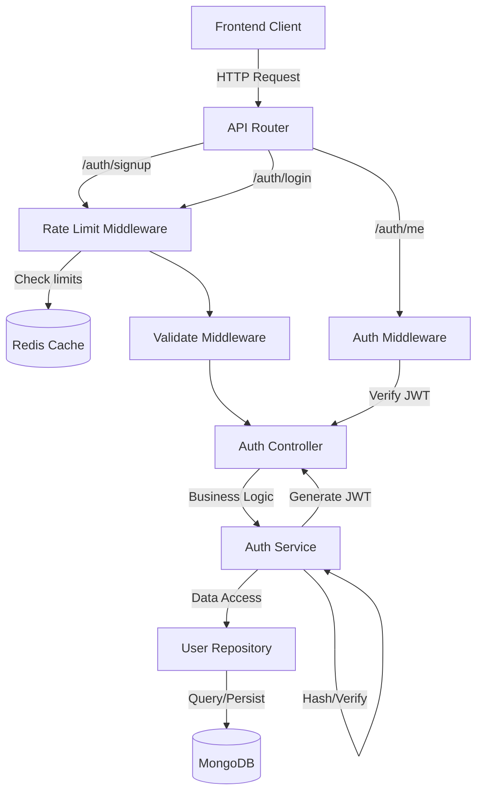
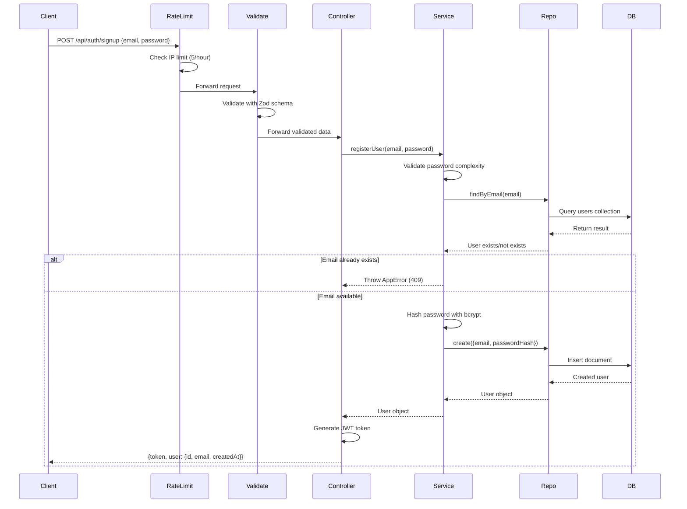
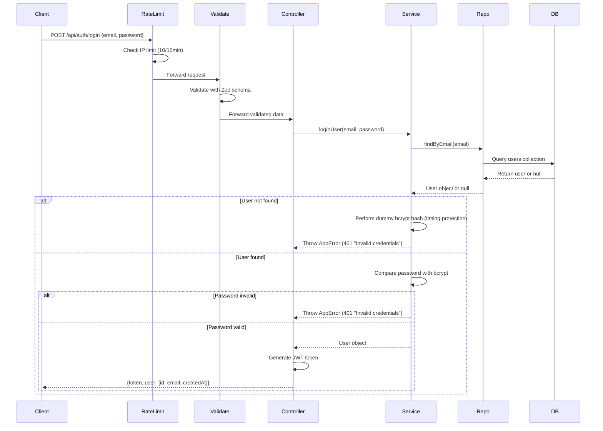
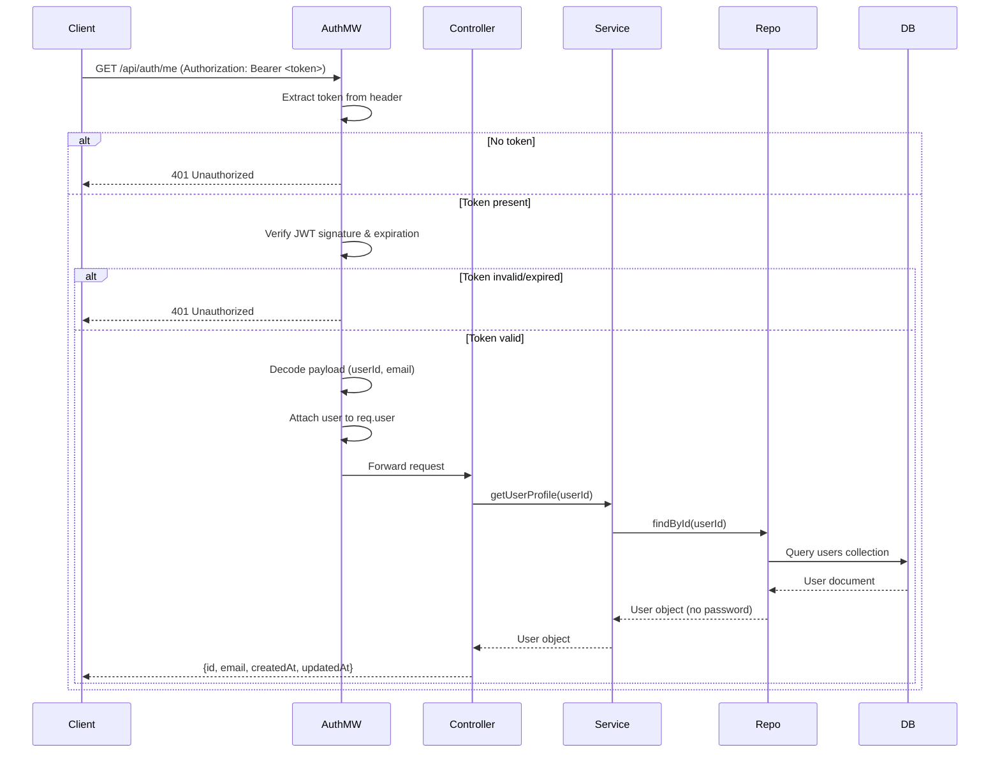

# Authentication System - Technical Design

## Overview

This document specifies the technical design for a JWT-based authentication system for the Amazon Instant Engine application. The system provides secure user registration, login, session management, and route protection capabilities. It integrates seamlessly with the existing TypeScript/Express backend architecture, following established patterns for controllers, services, repositories, middleware, validation, and error handling.

### Key Features

- Email/password-based user registration and login
- JWT token generation and validation (HS256 algorithm, 7-day expiration)
- Bcrypt password hashing with configurable salt rounds
- Protected route middleware for authentication enforcement
- Redis-based rate limiting to prevent brute force attacks
- Zod schema validation for all inputs
- Frontend React components for signup/login with session persistence
- User profile endpoint for authenticated users
- Comprehensive error handling with security-conscious messaging

### Design Goals

1. **Security-First**: Implement industry-standard authentication practices including bcrypt hashing, JWT signing, rate limiting, and protection against timing attacks
2. **Seamless Integration**: Follow existing code patterns (asyncHandler, validate middleware, AppError, controller/service/repository layers)
3. **Developer Experience**: Provide clear, consistent API responses and comprehensive error messages
4. **Scalability**: Use stateless JWT tokens and Redis-backed rate limiting to support horizontal scaling
5. **Maintainability**: Maintain separation of concerns with clear boundaries between layers

## Architecture

### System Components




### Layer Responsibilities

**Frontend Layer**:
- Signup and login form components with controlled inputs
- Client-side validation for immediate user feedback
- JWT token storage in localStorage
- Automatic token inclusion in API requests via Authorization header
- Session persistence across page refreshes
- Logout functionality with token removal and redirect

**API Layer (Routes)**:
- Route registration: `POST /api/auth/signup`, `POST /api/auth/login`, `GET /api/auth/me`
- Middleware composition: rate limiting → validation → asyncHandler → controller
- Integration with existing router in `src/routes/index.ts`

**Middleware Layer**:
- **Rate Limiting**: Redis-backed request throttling per IP (5 signups/hour, 10 logins/15min)
- **Validation**: Zod schema validation using existing `validateBody` middleware
- **Authentication**: JWT verification middleware for protected routes
- **Error Handling**: Existing `errorHandler` catches and formats all errors

**Controller Layer** (`authController.ts`):
- Request/response handling for signup, login, and profile endpoints
- JWT token generation after successful authentication
- Response formatting with user object and token
- Extraction of authenticated user from request object (populated by auth middleware)

**Service Layer** (`authService.ts`):
- User registration business logic (duplicate check, password hashing, user creation)
- User login business logic (credential verification, timing-attack protection)
- Password hashing with bcrypt (configurable salt rounds)
- Password validation against complexity requirements
- Generic error messages to prevent account enumeration

**Repository Layer** (`userRepository.ts`):
- Database operations: create user, find by email, find by ID
- Email normalization (lowercase conversion)
- Mongoose model interaction with type safety
- Query optimization with email index

**Data Layer** (MongoDB):
- User document persistence with Mongoose
- Unique index on email field for fast lookups and duplicate prevention
- Automatic timestamp management (createdAt, updatedAt)

### Authentication Flow

#### Registration Flow




#### Login Flow



#### Protected Route Access Flow



## Components and Interfaces

### API Endpoints

#### POST /api/auth/signup

**Purpose**: Register a new user account

**Middleware Stack**:
1. `createRateLimiter(5, 3600)` - 5 requests per hour per IP
2. `validateBody(signupSchema)` - Validate request body
3. `asyncHandler(signup)` - Controller handler

**Request Body**:
```typescript
{
  email: string;    // Valid email format, max 254 chars
  password: string; // 8-128 chars, must contain uppercase, lowercase, number, special char
}
```

**Success Response** (201):
```typescript
{
  token: string;  // JWT token (expires in 7 days)
  user: {
    id: string;
    email: string;
    createdAt: string; // ISO 8601 timestamp
  }
}
```

**Error Responses**:
- `400 VALIDATION_ERROR`: Invalid email format or password requirements not met
- `409 EMAIL_ALREADY_EXISTS`: Email is already registered
- `429 RATE_LIMIT_EXCEEDED`: Too many signup attempts from IP
- `500 INTERNAL_ERROR`: Server error (bcrypt failure, database error)

#### POST /api/auth/login

**Purpose**: Authenticate an existing user

**Middleware Stack**:
1. `createRateLimiter(10, 900)` - 10 requests per 15 minutes per IP
2. `validateBody(loginSchema)` - Validate request body
3. `asyncHandler(login)` - Controller handler

**Request Body**:
```typescript
{
  email: string;
  password: string;
}
```

**Success Response** (200):
```typescript
{
  token: string;
  user: {
    id: string;
    email: string;
    createdAt: string;
  }
}
```

**Error Responses**:
- `400 VALIDATION_ERROR`: Invalid email format
- `401 INVALID_CREDENTIALS`: Email or password is incorrect (generic message)
- `429 RATE_LIMIT_EXCEEDED`: Too many login attempts from IP
- `500 INTERNAL_ERROR`: Server error

#### GET /api/auth/me

**Purpose**: Get current authenticated user's profile

**Middleware Stack**:
1. `authenticate` - Verify JWT token and populate req.user
2. `asyncHandler(getProfile)` - Controller handler

**Headers Required**:
```
Authorization: Bearer <jwt_token>
```

**Success Response** (200):
```typescript
{
  id: string;
  email: string;
  createdAt: string;
  updatedAt: string;
}
```

**Error Responses**:
- `401 UNAUTHORIZED`: Missing, invalid, or expired JWT token
- `404 NOT_FOUND`: User not found (token valid but user deleted)
- `500 INTERNAL_ERROR`: Server error

### TypeScript Interfaces


#### User Model Interface

```typescript
// Full user document (internal use only)
export interface IUser {
  id: string;
  email: string;
  password: string;  // Bcrypt hash
  createdAt: Date;
  updatedAt: Date;
}

// User data for API responses (password excluded)
export interface UserResponse {
  id: string;
  email: string;
  createdAt: string;
  updatedAt?: string;
}

// JWT token payload
export interface JWTPayload {
  userId: string;
  email: string;
  iat: number;  // Issued at timestamp
  exp: number;  // Expiration timestamp
}

// Extended Express Request with authenticated user
export interface AuthenticatedRequest extends Request {
  user: {
    userId: string;
    email: string;
  };
}
```

#### Service Layer Interfaces

```typescript
export interface AuthService {
  registerUser(email: string, password: string): Promise<UserResponse>;
  loginUser(email: string, password: string): Promise<UserResponse>;
  getUserById(userId: string): Promise<UserResponse>;
  validatePassword(password: string): void; // Throws on invalid
  hashPassword(password: string): Promise<string>;
  comparePassword(plaintext: string, hash: string): Promise<boolean>;
}

export interface UserRepository {
  create(email: string, passwordHash: string): Promise<IUser>;
  findByEmail(email: string): Promise<IUser | null>;
  findById(id: string): Promise<IUser | null>;
}
```

### Validation Schemas (Zod)

```typescript
import { z } from 'zod';

// Email validation: RFC 5322 compliant, max 254 chars
const emailSchema = z
  .string()
  .email('Invalid email format')
  .max(254, 'Email must not exceed 254 characters')
  .transform((val) => val.trim().toLowerCase());

// Password validation: 8-128 chars with complexity requirements
const passwordSchema = z
  .string()
  .min(8, 'Password must be at least 8 characters')
  .max(128, 'Password must not exceed 128 characters')
  .regex(/[A-Z]/, 'Password must contain at least one uppercase letter')
  .regex(/[a-z]/, 'Password must contain at least one lowercase letter')
  .regex(/[0-9]/, 'Password must contain at least one number')
  .regex(/[^A-Za-z0-9]/, 'Password must contain at least one special character');

// Signup schema
export const signupSchema = z.object({
  email: emailSchema,
  password: passwordSchema,
});

// Login schema (no password complexity validation needed)
export const loginSchema = z.object({
  email: emailSchema,
  password: z.string().min(1, 'Password is required'),
});

export type SignupInput = z.infer<typeof signupSchema>;
export type LoginInput = z.infer<typeof loginSchema>;
```

## Data Models

### User Mongoose Schema

```typescript
import { Schema, model, Document } from 'mongoose';

export interface IUserDocument extends Document {
  email: string;
  password: string;
  createdAt: Date;
  updatedAt: Date;
}

const UserSchema = new Schema<IUserDocument>(
  {
    email: {
      type: String,
      required: true,
      unique: true,
      lowercase: true,
      trim: true,
      maxlength: 254,
      match: [/^\S+@\S+\.\S+$/, 'Invalid email format'],
    },
    password: {
      type: String,
      required: true,
      select: false, // Never include password in queries by default
    },
  },
  {
    timestamps: true, // Automatically manages createdAt and updatedAt
    versionKey: false,
  }
);

// Index for fast email lookups and duplicate prevention
UserSchema.index({ email: 1 }, { unique: true });

// Transform to exclude password from JSON responses
UserSchema.set('toJSON', {
  transform: (_doc, ret) => {
    ret.id = ret._id.toString();
    delete ret._id;
    delete ret.password;
    return ret;
  },
});

export const UserModel = model<IUserDocument>('User', UserSchema);
```

### Database Indexes

**Primary Index**:
- `{ email: 1 }` - Unique index for fast email lookups and duplicate prevention
- Supports: User registration duplicate checks, login authentication

**Built-in Indexes**:
- `{ _id: 1 }` - Primary key for user profile retrieval by ID

## JWT Token Structure

### Token Generation

```typescript
import jwt from 'jsonwebtoken';
import { env } from '../config/env';

export function generateToken(userId: string, email: string): string {
  const payload: JWTPayload = {
    userId,
    email,
    iat: Math.floor(Date.now() / 1000),
    exp: Math.floor(Date.now() / 1000) + 7 * 24 * 60 * 60, // 7 days
  };
  
  return jwt.sign(payload, env.auth.jwtSecret, {
    algorithm: 'HS256',
    expiresIn: env.auth.jwtExpiresIn,
  });
}
```

### Token Verification

```typescript
export function verifyToken(token: string): JWTPayload {
  try {
    const decoded = jwt.verify(token, env.auth.jwtSecret, {
      algorithms: ['HS256'],
    }) as JWTPayload;
    
    return decoded;
  } catch (error) {
    if (error instanceof jwt.TokenExpiredError) {
      throw new AppError('Token has expired', 401, 'TOKEN_EXPIRED');
    }
    if (error instanceof jwt.JsonWebTokenError) {
      throw new AppError('Invalid token', 401, 'INVALID_TOKEN');
    }
    throw new AppError('Token verification failed', 401, 'AUTH_FAILED');
  }
}
```

### Token Payload Structure


```json
{
  "userId": "507f1f77bcf86cd799439011",
  "email": "user@example.com",
  "iat": 1704067200,
  "exp": 1704672000
}
```

**Fields**:
- `userId`: MongoDB ObjectId as string for user identification
- `email`: User's email for display purposes
- `iat`: Issued At - Unix timestamp when token was created
- `exp`: Expiration - Unix timestamp when token expires (7 days from iat)

### Token Storage (Frontend)

**Storage Location**: `localStorage` with key `auth_token`

**Rationale**: 
- Simple implementation for SPA authentication
- Persists across page refreshes and browser sessions
- Accessible from all frontend code
- Trade-off: Vulnerable to XSS (mitigated by careful dependency management)

**Alternative Considered**: HttpOnly cookies
- More secure against XSS but requires server-side session management
- Adds complexity for token refresh flows
- Not chosen for this implementation to maintain stateless architecture

## Middleware Architecture

### Authentication Middleware

**File**: `src/middlewares/authenticate.ts`

```typescript
import { Response, NextFunction } from 'express';
import { AppError } from '../errors';
import { verifyToken } from '../utils/jwt';
import { AuthenticatedRequest } from '../types/auth';

/**
 * Middleware that verifies JWT tokens and attaches user info to request.
 * Used to protect routes that require authentication.
 */
export function authenticate(
  req: AuthenticatedRequest,
  _res: Response,
  next: NextFunction
): void {
  // Extract token from Authorization header
  const authHeader = req.headers.authorization;
  
  if (!authHeader || !authHeader.startsWith('Bearer ')) {
    next(new AppError('No authentication token provided', 401, 'UNAUTHORIZED'));
    return;
  }
  
  const token = authHeader.substring(7); // Remove 'Bearer ' prefix
  
  try {
    const payload = verifyToken(token);
    
    // Attach user info to request for downstream handlers
    req.user = {
      userId: payload.userId,
      email: payload.email,
    };
    
    next();
  } catch (error) {
    // verifyToken throws AppError for expired/invalid tokens
    next(error);
  }
}
```

### Rate Limiting Middleware

**File**: `src/middlewares/rateLimit.ts`

```typescript
import { Request, Response, NextFunction } from 'express';
import { getRedis } from '../config/redis';
import { AppError } from '../errors';
import { logger } from '../config/logger';

/**
 * Creates a Redis-backed rate limiter middleware.
 * @param maxRequests Maximum number of requests allowed in the window
 * @param windowSeconds Time window in seconds
 */
export function createRateLimiter(maxRequests: number, windowSeconds: number) {
  return async (req: Request, _res: Response, next: NextFunction): Promise<void> => {
    const redis = getRedis();
    
    // Fall back to no rate limiting if Redis is unavailable (best-effort)
    if (!redis) {
      logger.warn('Rate limiting disabled - Redis unavailable');
      next();
      return;
    }
    
    // Use IP address as the rate limit key
    const ip = req.ip || req.socket.remoteAddress || 'unknown';
    const key = `rate_limit:${req.path}:${ip}`;
    
    try {
      const current = await redis.incr(key);
      
      // Set expiration on first request in the window
      if (current === 1) {
        await redis.expire(key, windowSeconds);
      }
      
      if (current > maxRequests) {
        next(
          new AppError(
            'Too many requests. Please try again later.',
            429,
            'RATE_LIMIT_EXCEEDED'
          )
        );
        return;
      }
      
      next();
    } catch (error) {
      // Redis error - fail open (allow request) rather than fail closed
      logger.error('Rate limiter error', { error: (error as Error).message });
      next();
    }
  };
}

// Pre-configured rate limiters for auth endpoints
export const signupRateLimit = createRateLimiter(5, 3600);      // 5 per hour
export const loginRateLimit = createRateLimiter(10, 900);       // 10 per 15min
```

**Rate Limiting Strategy**:
- **Signup**: 5 requests per hour per IP - prevents mass account creation
- **Login**: 10 requests per 15 minutes per IP - balances security and usability
- **Key Format**: `rate_limit:{endpoint}:{ip}` for per-endpoint, per-IP tracking
- **Failure Mode**: Fail open (allow requests) if Redis is unavailable to maintain availability
- **TTL Management**: Automatic expiration after window duration

## Security Implementation

### Password Hashing (Bcrypt)

```typescript
import bcrypt from 'bcrypt';
import { env } from '../config/env';

/**
 * Hashes a plaintext password using bcrypt with configured salt rounds.
 * Uses async version to avoid blocking the event loop.
 */
export async function hashPassword(password: string): Promise<string> {
  const saltRounds = env.auth.bcryptSaltRounds;
  return bcrypt.hash(password, saltRounds);
}

/**
 * Compares a plaintext password with a bcrypt hash.
 * Uses constant-time comparison to prevent timing attacks.
 */
export async function comparePassword(
  plaintext: string,
  hash: string
): Promise<boolean> {
  return bcrypt.compare(plaintext, hash);
}

/**
 * Performs a dummy hash operation to prevent timing attacks.
 * Called when user is not found to make timing consistent.
 */
export async function dummyHash(): Promise<void> {
  await bcrypt.hash('dummy-password-for-timing-protection', env.auth.bcryptSaltRounds);
}
```

**Security Properties**:
- **Salt Rounds**: Configurable (default 10) to balance security and performance
- **Async Operations**: Uses `bcrypt.hash()` and `bcrypt.compare()` to avoid blocking
- **Timing Attack Protection**: Dummy hash when user not found ensures consistent response time
- **No Salt Reuse**: Bcrypt generates a unique salt per password automatically

### Timing Attack Prevention


**Login Flow with Timing Protection**:

```typescript
async loginUser(email: string, password: string): Promise<UserResponse> {
  const user = await userRepository.findByEmail(email);
  
  if (!user) {
    // Perform dummy hash to match timing of successful path
    await dummyHash();
    throw new AppError('Invalid credentials', 401, 'INVALID_CREDENTIALS');
  }
  
  const isValid = await comparePassword(password, user.password);
  
  if (!isValid) {
    throw new AppError('Invalid credentials', 401, 'INVALID_CREDENTIALS');
  }
  
  return {
    id: user.id,
    email: user.email,
    createdAt: user.createdAt.toISOString(),
  };
}
```

**Why This Matters**:
- Without timing protection, attackers can determine if an email exists by measuring response time
- User not found path would be faster (no bcrypt comparison)
- Dummy hash makes both paths take similar time, preventing account enumeration

### Account Enumeration Prevention

**Generic Error Messages**:
- Login failure: Always return "Invalid credentials" (never "Email not found" or "Wrong password")
- Registration: Return 409 for existing email, but don't reveal details in other contexts

**Password Reset** (Future):
- Always return "If the email exists, a reset link has been sent" regardless of whether email exists

### Password Complexity Validation

**Requirements Enforced**:
1. Minimum 8 characters (prevents short, easily guessed passwords)
2. Maximum 128 characters (prevents DoS via excessive bcrypt work)
3. At least one uppercase letter (increases entropy)
4. At least one lowercase letter (increases entropy)
5. At least one number (increases entropy)
6. At least one special character (increases entropy)

**Common Password Check** (Requirement 13.2):
```typescript
// List of top 10,000 most common passwords (to be loaded at startup)
const COMMON_PASSWORDS = new Set<string>(/* loaded from file */);

export function validatePassword(password: string): void {
  // Zod schema checks already enforce length and character requirements
  
  // Check against common password list
  if (COMMON_PASSWORDS.has(password.toLowerCase())) {
    throw new AppError(
      'Password is too common. Please choose a stronger password.',
      400,
      'WEAK_PASSWORD'
    );
  }
}
```

### JWT Security

**Configuration**:
- Algorithm: HS256 (HMAC with SHA-256)
- Secret: Minimum 32 characters, loaded from environment
- Expiration: 7 days (configurable)
- Claims: userId, email, iat, exp

**Security Considerations**:
- Secret must be strong (validated at startup)
- Tokens are stateless (no server-side session storage required)
- Expiration enforced via `exp` claim
- No refresh token in initial implementation (users re-login after 7 days)

**Token Validation Checks**:
1. Signature verification (prevents tampering)
2. Expiration check (enforces time-limited sessions)
3. Algorithm verification (prevents algorithm substitution attacks)

## Frontend Components

### Authentication Context (React)

**File**: `frontend/src/contexts/AuthContext.tsx`

```typescript
import React, { createContext, useContext, useState, useEffect } from 'react';
import { jwtDecode } from 'jwt-decode';

interface User {
  id: string;
  email: string;
}

interface AuthContextType {
  user: User | null;
  token: string | null;
  login: (token: string) => void;
  logout: () => void;
  isAuthenticated: boolean;
}

const AuthContext = createContext<AuthContextType | undefined>(undefined);

export function AuthProvider({ children }: { children: React.ReactNode }) {
  const [token, setToken] = useState<string | null>(null);
  const [user, setUser] = useState<User | null>(null);
  
  // Load token from localStorage on mount
